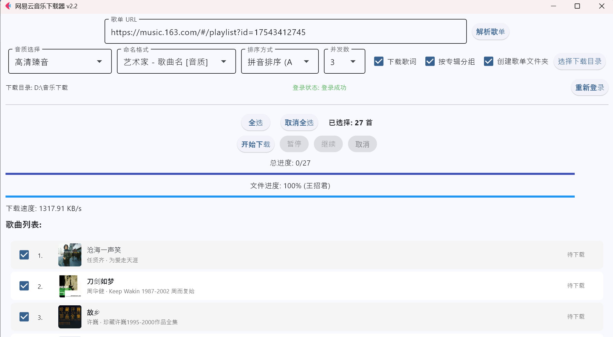

# DownList
 
 
> An application to download unlimited amount of music from Netease playlist.
> 一个可以无限制下载网易云音乐歌单的应用
 

## 界面



### 特色

**免登录 绕过每月400首额度 直接保存为 `MP3`、`FLAC`格式**

---

## 🎉 v2.0 新功能

### ✨ 音质中文显示
- 音质选项现已支持中文显示
- 对应网易云官方音质名称：标准、极高、无损、高清臻音、超清母带、沉浸环绕声

### ✅ 歌曲选择下载
- 解析歌单后可**自由勾选**需要下载的歌曲
- 支持「全选」和「取消全选」快捷操作
- 实时显示已选择歌曲数量
- 只下载您勾选的歌曲，节省时间和空间

### 📊 独立进度显示
- 每首歌曲显示**独立的下载进度条**
- 实时状态更新：
  - 🔘 待下载 → 🔵 下载中 → 🟢 已完成
  - 🔴 失败 / 🟠 已取消
- 一目了然掌握每首歌曲的下载状态

---

## 🚀 v2.1.2 新功能

### 🏗️ 代码分层重构
- 项目结构优化，按功能拆分为独立模块
- `src/api` - 网易云 API 封装
- `src/auth` - Cookie 管理与登录
- `src/core` - 下载核心逻辑
- `src/ui` - 界面组件
- `src/utils` - 工具函数

### 🔐 网易云网站登录
- 支持通过浏览器（Edge/Chrome）直接登录网易云获取 Cookie (完美兼容 Windows & macOS)
- 无需手动复制 Cookie，登录成功后自动保存
- 保留原有 `cookie.txt` 方式，优先读取本地文件
- 支持「重新登录」切换账号

### 📂 已下载歌曲识别
- 解析歌单后自动扫描下载目录（包括子目录）
- 已下载歌曲显示 `(已下载)` 标识
- 已下载歌曲自动排序到列表末尾
- 已下载歌曲默认不选中，避免重复下载

### 📝 自定义文件命名
- 支持四种命名格式：
  - `歌曲名 - 艺术家` (默认)
  - `艺术家 - 歌曲名`
  - `歌曲名 - 艺术家 [音质]`
  - `艺术家 - 歌曲名 [音质]`
- 歌词文件自动使用相同命名格式
- 带音质的命名格式会精确匹配音质标识

### 🔤 拼音排序
- 支持按歌曲名拼音首字母 A-Z 排序
- 方便在大歌单中快速定位歌曲
- 排序选项：默认顺序 / 拼音升序 (A-Z)

### 💾 配置自动保存
- 所有配置自动保存到 `config.json`，下次启动自动加载
- 保存的配置项：
  - 音质选择（标准/极高/无损/高清臻音等）
  - 命名格式（歌曲名 - 艺术家 等）
  - 排序方式（默认顺序/拼音排序）
  - 并发下载数（1-5）
  - 下载歌词开关
  - 按专辑分组开关
  - 创建歌单文件夹开关
  - 下载目录路径
- 无需每次重新配置，打开即用

---
## 🚀 v2.2 新功能

### 📁 灵活的文件夹组织
- **创建歌单文件夹**：支持自动为每个解析的歌单创建独立文件夹，避免文件混乱（默认开启）
- **按专辑分组**：支持在歌单文件夹内进一步按专辑创建子目录，实现更精细的分类管理
- 用户可以根据喜好自由开启或关闭这些选项，支持自定义目录结构

---

## 🚀 v2.3 下载速度优化

### ⚡ 高性能下载引擎
- **更大的传输块**：chunk_size 从 8KB 增大到 64KB，显著提升单文件传输效率
- **TCP 连接复用**：使用全局 Session 连接池，避免重复建立连接
- **连接池优化**：支持最多 10 个并发连接，网络利用率更高

### 🔄 并行下载
- **多线程并发**：支持同时下载多首歌曲，大幅缩短批量下载时间
- **并发数配置**：界面新增「并发数」下拉框，支持 1-5 个并行下载任务
- **智能进度显示**：实时显示总进度、已完成数量和当前并发状态

---


## 开始准备

你需要准备：

1. 一台正常的电脑，安装了 Python 3.8+
2. 网易云音乐账号（建议用有黑胶VIP的，没有VIP会有歌曲下载不了）


## 下载安装

### 方式一：直接下载程序

**Windows 用户：**
到 Release 或 [蓝奏云（密码:39vn）](https://wwbnp.lanzoum.com/ij9Mr3dicjta) 中下载，解压后直接运行即可。

### 方式二：源码运行

**Windows 用户：**

```bash
# 克隆项目
git clone https://github.com/741liufei/DownList.git
cd DownList

# 安装依赖
pip install -r requirements.txt

# 运行程序
python main.py
```

**macOS/Linux 用户：**

```bash
# 克隆项目
git clone https://github.com/741liufei/DownList.git
cd DownList

# 安装依赖
pip3 install -r requirements.txt

# 运行程序
python3 main.py
```

> 📖 macOS 用户请查看 [macOS 安装指南](MACOS_SETUP.md) 获取详细说明

## 使用方法

1. 运行程序，点击**「登录网易云」**按钮，在弹出的浏览器中完成登录

2. 复制歌单链接，粘贴到输入框中，点击**「解析歌单」**

3. 选择下载音质、命名格式、下载目录

4. 勾选需要下载的歌曲，点击**「开始下载」**

5. Enjoy :D

## 项目结构

```
DownList/
├── main.py                 # 程序入口
├── requirements.txt        # 依赖列表
├── cookie.txt              # Cookie 文件（登录后生成）
├── config.json             # 配置文件（自动生成）
├── download.log            # 下载日志（运行时生成）
├── assets/
│   └── display.png         # 界面截图
└── src/
    ├── __init__.py         # 包初始化
    ├── api/
    │   ├── __init__.py
    │   └── netease_api.py  # 网易云 API 封装
    ├── auth/
    │   ├── __init__.py
    │   └── cookie_manager.py # Cookie 管理与浏览器登录
    ├── core/
    │   ├── __init__.py
    │   └── downloader.py   # 下载核心逻辑
    ├── ui/
    │   ├── __init__.py
    │   └── app.py          # Flet UI 界面
    └── utils/
        ├── __init__.py
        └── helpers.py      # 工具函数
```

---

## 核心模块说明

### 1. Cookie 管理 (`src/auth/cookie_manager.py`)

**`CookieManager` 类** - Cookie 管理器，支持本地文件读取和浏览器登录获取

| 方法 | 说明 |
|------|------|
| `cookie_exists()` | 检查本地 Cookie 文件是否存在 |
| `read_cookie()` | 读取 Cookie 文件内容 |
| `parse_cookie()` | 解析 Cookie 字符串为字典 |
| `save_cookie(cookies)` | 保存 Cookie 到文件 |
| `login_via_browser(timeout)` | 通过 Selenium 浏览器登录获取 Cookie |
| `get_cookies()` | 获取 Cookie，优先从缓存获取 |

### 2. 网易云 API (`src/api/netease_api.py`)

| 函数 | 说明 |
|------|------|
| `post(url, params, cookies)` | 发送加密 POST 请求到网易云 API |
| `url_v1(song_id, level, cookies)` | 获取歌曲下载链接 |
| `name_v1(song_id)` | 获取歌曲详细信息 |
| `lyric_v1(song_id, cookies)` | 获取歌曲歌词 |
| `playlist_detail(playlist_id, cookies)` | 获取歌单详情及歌曲列表 |

**音质映射 (`QUALITY_MAP`)**：

| API 参数 | 中文名称 |
|---------|---------|
| `standard` | 标准 |
| `exhigh` | 极高 |
| `lossless` | 无损 |
| `jyeffect` | 高清臻音 |
| `jymaster` | 超清母带 |
| `sky` | 沉浸环绕声 |

### 3. 下载器 (`src/core/downloader.py`)

**`Downloader` 类** - 下载器，封装下载状态和控制逻辑

| 方法 | 说明 |
|------|------|
| `reset()` | 重置下载状态 |
| `pause()` | 暂停下载 |
| `resume()` | 继续下载 |
| `cancel()` | 取消下载 |
| `download_file(url, file_path, track_id)` | 流式下载文件，支持进度回调 |
| `add_metadata(...)` | 为音频文件嵌入元数据（标题、艺术家、专辑、封面） |

**特性**：
- 支持暂停/继续/取消控制
- 自动重试机制（3次）
- 实时进度和速度回调
- 支持 MP3 和 FLAC 格式元数据嵌入
- **64KB chunk_size** 优化传输效率
- **全局 Session 连接池** 复用 TCP 连接
- **并行下载支持** （可配置 1-5 个并发任务）

### 4. 工具函数 (`src/utils/helpers.py`)

| 函数 | 说明 |
|------|------|
| `sanitize_filename(filename)` | 清理文件名中的非法字符 |
| `generate_filename(...)` | 根据命名格式生成文件名 |
| `scan_downloaded_files(directory)` | 扫描目录中已下载的音乐文件（递归） |
| `is_song_downloaded(...)` | 检查歌曲是否已下载（支持音质匹配） |
| `get_pinyin_initial(text)` | 获取中文文本的拼音首字母 |
| `sort_tracks_by_pinyin(...)` | 按拼音首字母排序歌曲列表 |
| `sort_tracks_default(...)` | 默认顺序排序（已下载的排到末尾） |
| `extract_playlist_id(url)` | 从 URL 提取歌单 ID |

**命名格式选项**：

| 格式键 | 显示名称 | 示例 |
|--------|---------|------|
| `default` | 歌曲名 - 艺术家 | `青花瓷 - 周杰伦.mp3` |
| `artist_first` | 艺术家 - 歌曲名 | `周杰伦 - 青花瓷.mp3` |
| `default_quality` | 歌曲名 - 艺术家 [音质] | `青花瓷 - 周杰伦 [无损].flac` |
| `artist_first_quality` | 艺术家 - 歌曲名 [音质] | `周杰伦 - 青花瓷 [无损].flac` |

### 5. 用户界面 (`src/ui/app.py`)

**`MusicDownloaderApp` 类** - 主应用界面

使用 `Flet` 框架创建用户界面，包括：
- 歌单 URL 输入和解析
- 音质选择下拉框（中文显示）
- 命名格式选择下拉框（宽度 230px）
- 排序方式选择（默认顺序 / 拼音排序）
- 下载目录选择
- 登录状态显示和重新登录按钮
- 歌曲列表（支持勾选、显示已下载状态）
- 下载进度显示（总进度 + 单曲进度 + 速度）
- 下载控制（开始/暂停/继续/取消）

---

## 多线程

- **下载线程**：使用 `threading` 模块在后台处理下载任务，确保界面响应流畅

## 日志记录

- 使用 `logging` 模块记录下载过程中的各种信息和错误
- 日志保存到 `download.log` 文件（UTF-8 编码）

---

## ToDo


- [已完成] 优化软件体积大小
- [ ] 优化 jy* 等格式文件
- [ ] 优化 jy* 等格式元数据写入
- [已完成] 实现多线程下载（v2.3 已完成）


## 更新日志

查看 [CHANGELOG.md](CHANGELOG.md) 了解详细的版本更新历史。

最新版本 **v2.3** 已完全支持 Windows & macOS 系统，并包含下载速度优化！

---

## 备注

1. 本项目仅供学习，不为盈利。请不要用于商业用途，或者在咸鱼上转卖，传播等请联系本人，不要随意传播。
2. 本项目基于 [DownList](https://github.com/xxxkjing/DownList) ，用AI二次开发 感谢 xxxkjing
